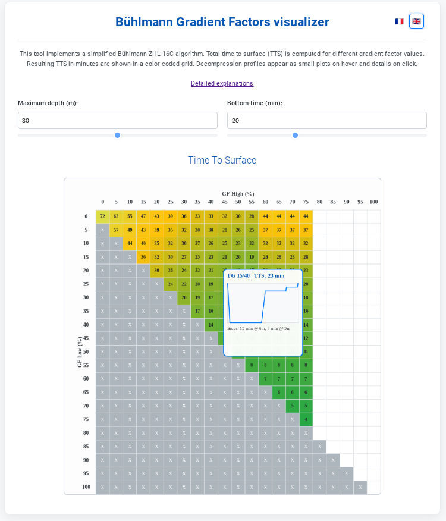

# Paliers

`paliers` is a client-side tool to compute and display scuba diving desaturation plans. It's built with HTML, CSS, and TypeScript, and requires no server-side components.

<div style="text-align: center;">
    
</div>

## How it Works

The tool implements the **Bühlmann ZHL-16C model** with Gradient Factors (GF) to calculate a safe decompression profile. It simulates the absorption and release of gaz across 16 tissue compartments during a dive, ensuring that the partial pressure of the gas in each compartment stays within a safe limit. This safety limit is defined by 2 parameters: the low and high Gradient Factor. Resulting dive plans are plotted with Plotly. 

The tool is available at [https://repied.github.io/paliers/](https://repied.github.io/paliers/).
It can also be downloaded locally from this [zip package](./dist/paliers.zip) and opened in the browser.

For a more detailed explanation, see the [full algorithm description](./docs/algorithm_en.md).

## Usage

The tool is available online at [https://repied.github.io/paliers/](https://repied.github.io/paliers/).

It can also be downloaded and run locally by opening the `index.html` file in your web browser.

# Contribution

The tool is automatically tested, built (`.ts` and `.md`) and deployed to Github pages on a push of the `main` branch. See github action config in `./github/*.yml`.

## Local Development Setup

To contribute to `paliers`, you'll need to set up the development environment for both TypeScript and Jekyll (for the documentation).

### Prerequisites

```
sudo apt update
```
- [Ruby and Bundler](https://jekyllrb.com/docs/installation/)
```
sudo apt install ruby-full build-essential zlib1g-dev
gem install jekyll bundler jekyll-seo-tag
```
- [Jekyll](https://jekyllrb.com/docs/step-by-step/01-setup/):
```
bundle config set --local path '~/lib/gems' # need to install in user folder
bundle update
bundle install
```

- [Node.js and npm](https://nodejs.org/en/download/)
```
sudo apt install nodejs npm
sudo npm install -g typescript http-server
```
### Build
Install the package and its dependencies
```
npm install
```

Jekyll: to build and serve locally:
```
bundle exec jekyll serve --incremental --watch --livereload
```

Typescript: `npm run watch` to build and `npm run serve`.

### Test
Run all tests:
```
npm test
```
Run tests with coverage (optional):
```
npm test --coverage
```
Open coverage report with, for instance,
```
http-server ./coverage
```
## Codespace development
Code can be build and tested from a github codespace. As it is setup in `.devcontainer/devcontainer.json`, it should work out of the box.
